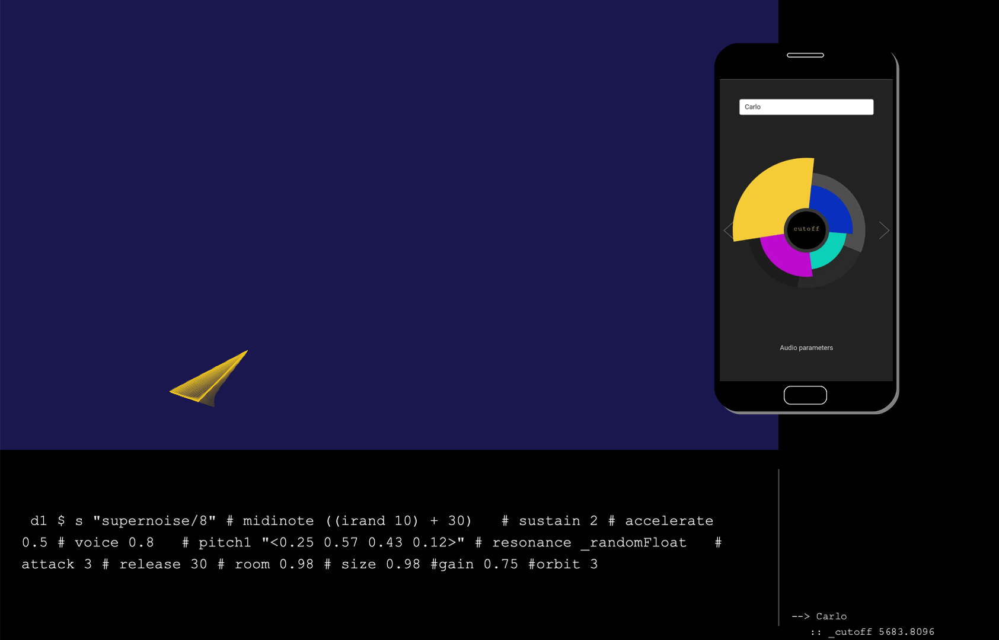

# **co²des**

**_co²des_** is an environment for enhanced live coding performances.
It can be considered as an interactive artistic installation in which the most important part is the audience.
It is based on the concept of making the people able to interact with the system so that they are active part of the creative process.
The live coder executes some code to generate the music leaving some parameter free, they are filled thanks to the user interactions.
The interaction is made through a web app and sent to the system.
The people are able to see the result in a visual, better if projected on a big screen, and obviously listening to the changes in the sound.

## **Features**
+ **Automatic visual generation**
  The resulting visual is completely generated by the attendants. Every user interaction contributes to generate new elements of the visual, based on the chosen category of parameters. The elements interact with each other to create more complex shapes and sometimes even novel elements.

+ **Evolutionary system to change the executed code**
  When user generated features interact with each other they can make the system evolve and generate new elements which will effectively change some parameters in the code executed by the live coder.

+ **Immediate and easy to use Web App**
  Every attendant can easily interact with the performance simply by connecting to a web app deployed on PythonAnywhere - [link](https://wemakethings.pythonanywhere.com/)

+ **Chat-style user interaction visualization**
  Every message sent by the participants will be visualized in a chat-style fashion, showing the usernames, the parameters they have chosen and the values they would like to assign.

+ **Live coder executed code block visualization**
  One of the principles of live coding is "showing the code", so every code block executed by the coder will be clearly visualized in a defined part of the screen.

<p align="center"></p>

## **Prerequisites**
This app is based on different software. To use the entire functionalities you have to install the following software:
+ [Processing](https://processing.org/)
+ [TidalCycles](https://tidalcycles.org/Welcome)
+ [Atom](https://atom.io/)

### Processing Dependencies
Before running the Processing script, you have to install these libraries:
+ _oscP5_ - [link](http://www.sojamo.de/libraries/oscP5/)
+ _netP5_ - [link](http://www.sojamo.de/libraries/oscp5/reference/netP5/package-summary.html)
+ _processing.sound_ - [link](https://processing.org/reference/libraries/sound/)
+ _http.request_ - [link](https://github.com/runemadsen/HTTP-Requests-for-Processing)


## **How To**
### Configure the machine
+ For the live coding part, refer to the official [installation guide](https://tidalcycles.org/Installation) to configure the [TidalCycles](https://tidalcycles.org/Welcome) environment. \
There is an "easy way" automatic script to install all the software related to this [here (macOs)](https://tidalcycles.org/MacOS_automated_installation) and [here (Win)](https://tidalcycles.org/Windows_choco_install).

+ For the visual part, you have to download [Processing](https://processing.org/download/) and simply install it.

### Configure the Atom text editor
From the coder side, the full app functionalities were tested using the [Atom](https://atom.io/) text editor.
To code in TidalCycles you need to install the official [package](https://atom.io/packages/tidalcycles) for Atom.
To use the full functionality, we had to "hack" the package.
In specific we have modified the `repl.js` file. \
On macOs `/Users/[USERNAME]/.atom/packages/tidalcycles/lib/repl.js` \
On Win `C:/Users/[USERNAME]/.atom/packages/tidalcycles/lib/repl.js`

You have to **substitute** this file with the one provided by us in the `./live coding/atom` folder, and **modify** the IP Address with the one showed on the Processing console.

**For example**, if the Processing console is like this
``` shell
### [2021/2/3 10:52:16] INFO @ OscP5 is running. you (192.168.1.224) are listening @ port 9000
```
the only thing you have to do is to copy this IP Address **from** Processing **to** the `repl.js` file. \
After this change, this file will look like this (`line 138`):
```javascript
this.myUdp.send(buf, 0, buf.length, 9000, "192.168.1.224");
```
After this operation you have to close and reopen the Atom editor. \
**NOTE.** The IP Address (i.e.`192.168.1.224`) has to be the **same**.

For more info, read the related `README.txt` in each sub-folder.

### Live coding session
Before starting the session, you have to do some preliminary operation inside the `configuration.tidal` file. After that, you can try the system by executing some lines inside the `live_session.tidal` file. \
You can find these files inside our `./livecoding/tidalcycles` folder.


## Known Issue
+ **macOs microphone permission** - [link](https://github.com/processing/processing-sound/issues/51#issuecomment-622929461)

+ **superCollider "late" messages** - [link](https://github.com/musikinformatik/SuperDirt/blob/develop/superdirt_startup.scd)


## Example Use
**VIDEO DEMO** - [YouTube](https://youtu.be/t5EOgvYc9z4)

An example of a single user interaction:
<p align="center"></p>

An example of multiple users interactions with child generation:
<p align="center"></p>


## Hack The System
+ change the screen size - default: `1550x1000`
+ different parameter mapping - see the `configuration.tidal` file
+ code with your own samples - [here](https://tidalcycles.org/Custom_Samples)
+ Change the audio input - default: _Internal Microphone_


### Authors
Antonio Giganti - [GitHub](https://github.com/antonelse) \
Carlo Pulvirenti - [GitHub](https://github.com/LoreTalone) \
Lorenzo Talone - [GitHub](https://github.com/carlopulv)

### License
This project is licensed under the GNU General Public License v3 - see `LICENSE.txt` for details.

**co²des** \
Copyright© 2021, Antonio Giganti, Carlo Pulvirenti & Lorenzo Talone.

### Useful Links

+ [TidalCycles Documentation](https://tidalcycles.org/Userbase)
+ [Live Coding Community](https://toplap.org/)
+ [Haskell Resources](https://tidalcycles.org/Haskell_resources)
+ [Awesome Live Coding List](https://github.com/toplap/awesome-livecoding/blob/master/README.md)
